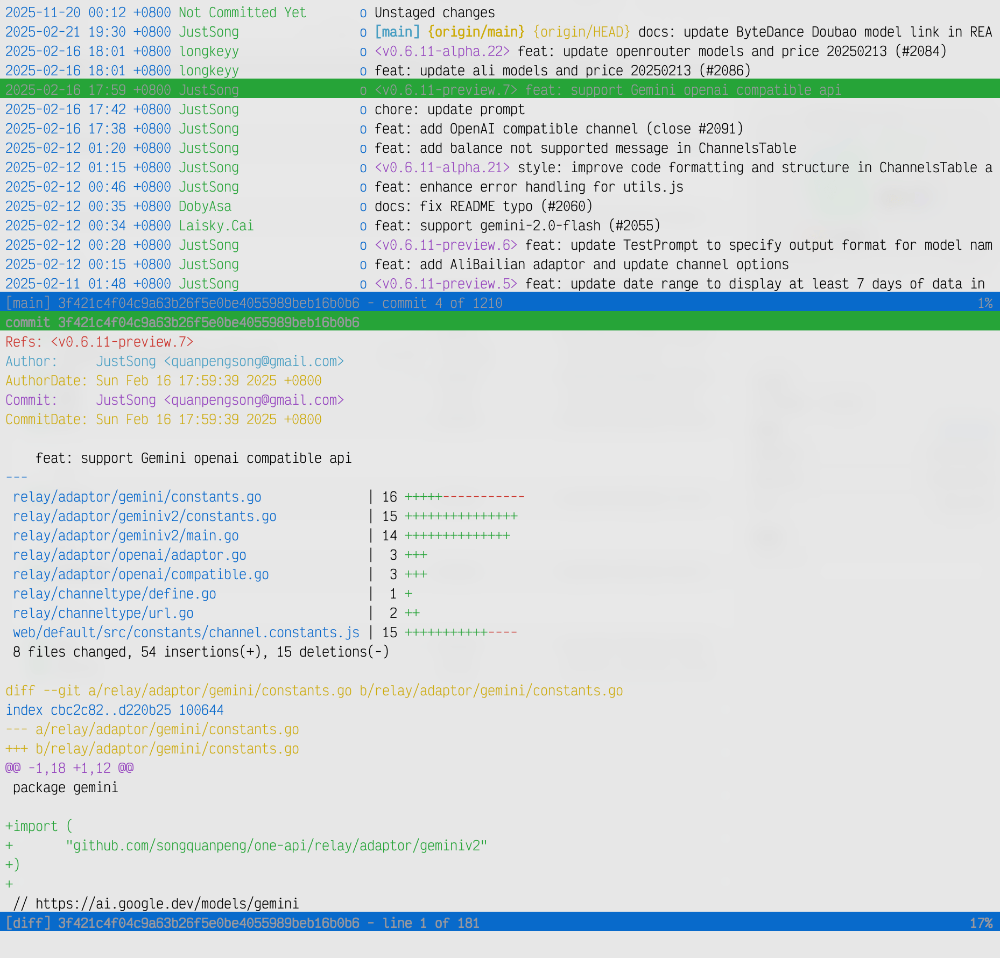
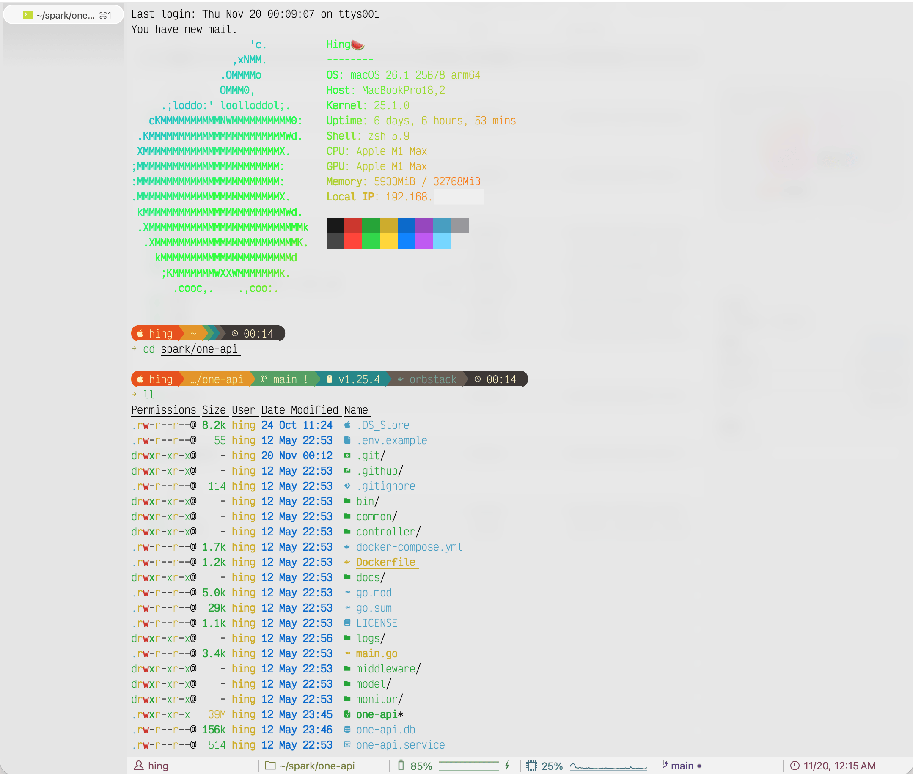

# **1. 目的**

一个高颜值、高效率的终端能让双手尽可能少离开键盘，保持流畅、连续、可预期的操作节奏。心情也会更好，逼格也更高。

# **2. 选择**

我个人的组合：

- **macOS**：iTerm2 + zsh
- **Linux**：zsh
- **Windows**：Windows Terminal + WSL + zsh

当然生态里可选项很多：Warp（AI增强）、Fish、Alacritty、Tabby、Kitty、WezTerm、Hyper 等等，各有亮点。折腾过一圈后，我最终还是稳定在 **zsh + oh-my-zsh** 作为主力。

> 小故事：入行那会儿对 mac 一无所知，每天背着 5kg 的 Windows 笔记本通勤三小时，最开始用 `git bash`，后来换成 `cmder`（现在似乎停更了，可惜）。

TL;DR

**一键安装：**

```bash
bash <(curl -fsSL https://raw.githubusercontent.com/Jiangultimo/one-for-terminal/main/install.sh)
```

或者克隆仓库后执行：

```bash
git clone https://github.com/Jiangultimo/one-for-terminal.git
cd one-for-terminal
bash install.sh
```

---

# **3. 步骤**

> 以下是手动安装的详细步骤，供想要自定义配置的用户参考。使用一键脚本的话可以跳过。

iTerm2 和 WSL 的安装省略（WSL 现在体验已经很好了）。

## **1. 安装 zsh**

文档：[https://github.com/ohmyzsh/ohmyzsh/wiki/Installing-ZSH](https://github.com/ohmyzsh/ohmyzsh/wiki/Installing-ZSH)
安装后务必执行：

```
chsh -s $(which zsh)
```

确保 zsh 成为默认 shell。首次进入时会提示创建配置文件，随便选即可。

## **2. 安装 oh-my-zsh**

官方安装脚本：[https://ohmyz.sh/#install](https://ohmyz.sh/#install)
安装后会生成 `.zshrc`。

## **3. 安装 Nerd Fonts（必选）**

否则符号会显示不完整。
字体下载：[https://www.nerdfonts.com/font-downloads](https://www.nerdfonts.com/font-downloads)
装完后，在终端设置里把字体切到你安装的 Nerd Font。

## **4. 安装 Starship**

不是 SpaceX 的那艘，是用 Rust 写的跨平台命令行提示符工具。
文档：[https://starship.rs/installing/](https://starship.rs/installing/)

## **5. 配置 Starship**

社区有很多预设可用：
[https://starship.rs/zh-CN/presets](https://starship.rs/zh-CN/presets)
挑一个喜欢的按说明放到 ~/.config/starship.toml 即可。

## **6. zsh 插件**

建议的两个基础插件：

```bash
# 自动补全
git clone https://github.com/zsh-users/zsh-autosuggestions \
  ${ZSH_CUSTOM:-~/.oh-my-zsh/custom}/plugins/zsh-autosuggestions

# 语法高亮
git clone https://github.com/zsh-users/zsh-syntax-highlighting.git \
  ${ZSH_CUSTOM:-~/.oh-my-zsh/custom}/plugins/zsh-syntax-highlighting
```

克隆完后，还需要在 `~/.zshrc` 中启用插件：

```bash
plugins=(git zsh-autosuggestions zsh-syntax-highlighting)
```

其他常用的：`sudo`（双击 ESC 自动加 sudo）、`z`（快速跳转目录），按需启用。

## **7. Vim / NeoVim**

Vim 原作者已离世，社区延续出了更现代的 **NeoVim**。
我用的是基于 NeoVim 的 **LunarVim**：
[https://www.lunarvim.org/](https://www.lunarvim.org/)

## **8. 用 eza 替代 ls/ll**

现代版 ls，颜值和可读性大幅提升：[https://github.com/eza-community/eza](https://github.com/eza-community/eza)

## **9. 安装 fzf（强烈推荐）**

模糊搜索神器：[https://github.com/junegunn/fzf](https://github.com/junegunn/fzf)

注意：
现代版本的 shell 集成更简单，按 README 的指引操作即可。

## **10. 安装 tig**

更舒服的 `git log` 浏览器，终端里看 Git 历史和 diff 很方便。

效果如图：


## **11. 安装 neofetch / lolcat / cowsay（可选）**

- **neofetch**：在终端显示系统信息和 ASCII Logo
- **lolcat**：让输出变成彩虹色
- **cowsay**：让一头牛说话

纯好玩，装逼利器。

# **4. 成果**

你就会得到下面这样一个终端(静态看起来好像也没什么特别的,笑):



---

## 📄 许可证

本项目采用 [MIT 许可证](LICENSE) 开源。

## 🤝 贡献

欢迎提交 Issue 和 Pull Request!

## ⭐ Star History

如果这个项目对你有帮助,欢迎给个 Star ⭐
